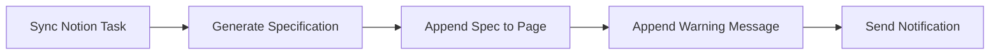

# Notion Warning Message Feature

## Overview

After Soma Squad AI automatically generates specifications for a task, a warning message is added to the top of the Notion page to inform users that the specs were auto-generated and manual modifications will not be tracked.

## Implementation

### Components Added

1. **NotionClient.appendCalloutToPage()** (`packages/sdk/src/notion/notion.client.ts:270-310`)
   - Adds a callout block to any Notion page
   - Supports custom emoji, text, and color
   - Non-critical operation (failures are logged but don't throw)

2. **appendWarningToNotionPage()** activity (`packages/worker/src/activities/notion.activities.ts:177-217`)
   - Temporal workflow activity that calls the NotionClient method
   - Uses environment variable or default message
   - Integrated into the main Soma Squad AI workflow

3. **Workflow Integration** (`packages/worker/src/workflows/soma-squad-ai.workflow.ts:91-94`)
   - Automatically called after spec generation
   - Runs before notification is sent

### Visual Result

When specs are generated, users see a yellow callout at the top of the Notion page:

```
⚠️ Les spécifications ont été générées automatiquement par Soma Squad AI.
   Les modifications manuelles ne seront pas prises en compte dans le flux de développement.
```

## Configuration

### Environment Variables

Add to your `.env` file:

```bash
# Custom warning message (Optional)
NOTION_SPEC_WARNING_MESSAGE="⚠️ Les spécifications ont été générées automatiquement par Soma Squad AI.\nLes modifications manuelles ne seront pas prises en compte dans le flux de développement."
```

If not provided, the default message (shown above) will be used.

### Customization

You can customize:
- **Message**: Set via `NOTION_SPEC_WARNING_MESSAGE` environment variable
- **Emoji**: Modify in `appendWarningToNotionPage` activity (default: ⚠️)
- **Color**: Modify in `appendWarningToNotionPage` activity (default: yellow_background)

Available colors:
- `yellow_background` (warning)
- `blue_background` (info)
- `green_background` (success)
- `red_background` (error)
- `gray_background` (neutral)

## Testing

### Manual Test Script

Test the functionality with a real Notion page:

```bash
cd packages/sdk

# Set your Notion credentials
export NOTION_API_KEY="your_notion_integration_token"
export NOTION_DATABASE_ID="your_database_id"
export NOTION_PAGE_ID="page_id_to_test_on"

# Run the test
npx ts-node src/__manual_tests__/test-notion-warning.ts
```

The test script will:
1. Add a warning callout (yellow)
2. Add an info callout (blue)
3. Add a success callout (green)

### Integration Test

The feature is automatically tested when you run a full Soma Squad AI workflow:

```bash
# Start Soma Squad AI services
docker-compose up -d

# Trigger a workflow (via CLI or API)
# The warning will appear on the Notion page after spec generation
```

## Technical Details

### Error Handling

The warning callout addition is **non-critical**:
- Failures are logged but don't stop the workflow
- If Notion API is unavailable, the workflow continues
- Useful for debugging without blocking development

### API Usage

Uses Notion Blocks API:
```typescript
await notion.blocks.children.append({
  block_id: pageId,
  children: [{
    object: 'block',
    type: 'callout',
    callout: {
      icon: { type: 'emoji', emoji: '⚠️' },
      rich_text: [{ type: 'text', text: { content: message } }],
      color: 'yellow_background',
    },
  }],
});
```

### Workflow Order



## Future Enhancements

Possible improvements:
1. **Position Control**: Add warning at top instead of bottom
2. **Update Detection**: Check if warning already exists before adding
3. **Conditional Logic**: Only add warning if specs exceed certain complexity
4. **Localization**: Support multiple languages based on user preference
5. **Template Support**: Allow custom templates with variable interpolation

## Related Files

- `packages/sdk/src/notion/notion.client.ts` - Notion client with callout method
- `packages/worker/src/activities/notion.activities.ts` - Workflow activities
- `packages/worker/src/workflows/soma-squad-ai.workflow.ts` - Main workflow orchestration
- `packages/sdk/src/__manual_tests__/test-notion-warning.ts` - Manual test script
- `.env.example` - Configuration documentation

## Support

If you encounter issues:
1. Check Notion integration permissions (Read content, Update content, Insert content)
2. Verify `NOTION_API_KEY` and `NOTION_DATABASE_ID` are correct
3. Check logs for detailed error messages
4. Run the manual test script to isolate the issue

## License

Part of Soma Squad AI - AI-Powered Development Workflow Automation Platform
